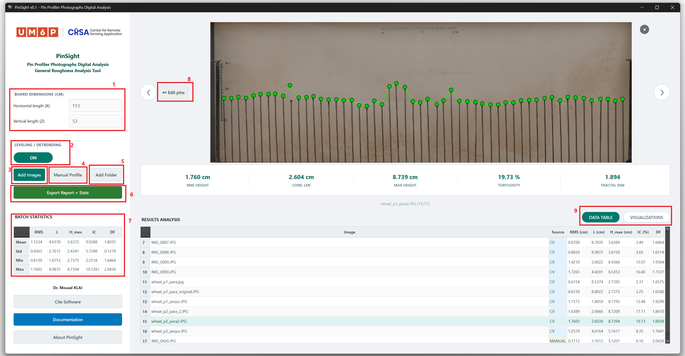
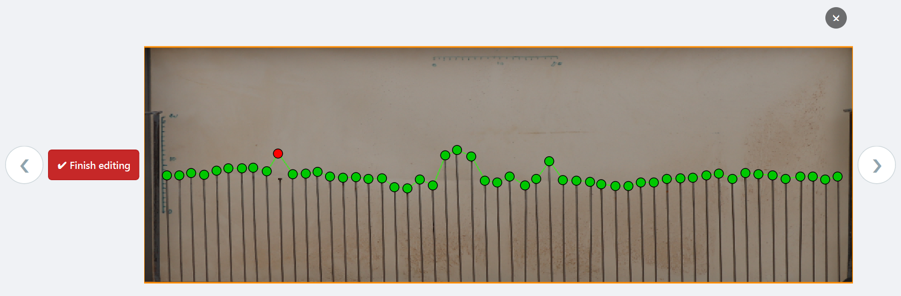
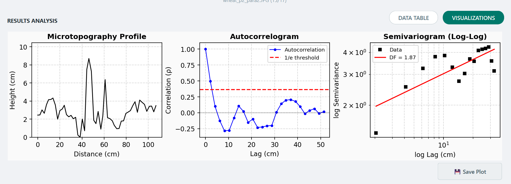
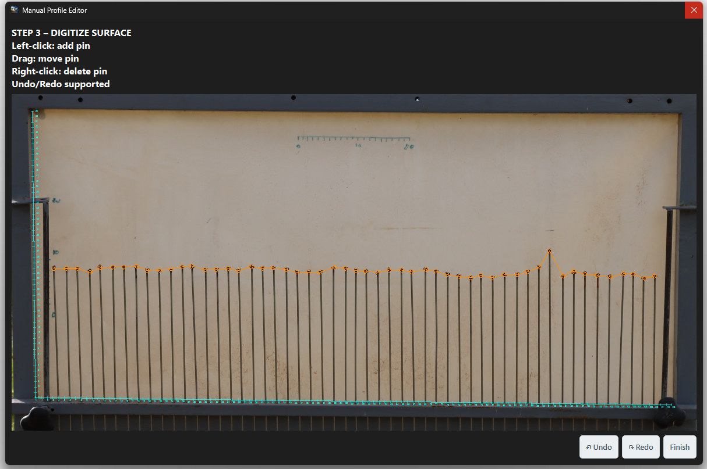

# PinSight  
**Digital Analysis of Pin Profiler Photographs for Soil Surface Roughness**

PinSight is a computer vision–based desktop application for the automated,
accurate, and reproducible processing of mechanical pin profiler photographs,
enabling quantitative characterization of soil surface roughness.

Designed for research in:

- Soil physics  
- Hydrology  
- Erosion science  
- Agricultural engineering  
- Environmental monitoring  

---

# Journal Submission

**Journal:** Computers and Electronics in Agriculture  

**Article Title:**  
PinSight: A computer vision-based software for the efficient and automated processing of pin profiler photographs for soil roughness analysis  

**Authors:**  
Mouad Klai*, Nadia Ouaadi, Mehrez Zribi, Abdelghani Chehbouni  

**Affiliations:**  

Centre for Remote Sensing Applications (CRSA),  
Mohammed VI Polytechnic University (UM6P),  
43150 Ben Guerir, Morocco  

CESBIO, UMR 5126, Université de Toulouse (UT3), CNRS, IRD, CNES, USC INRAE,  
31401 Toulouse Cedex 9, France  

*Corresponding Author:*  
mouad.klai-ext@um6p.ma  
klaimouadklai@gmail.com  

---

# Graphical User Interface (GUI)

The workflow is structured into three core functional modules:

1. Data Import and Pre-processing  
2. Interactive Pin Editing  
3. Visualization and Reporting  

---

## (a) Annotated Full Interface

**Annotated components:**

1. Board dimension inputs for pixel-to-metric scaling  
2. Optional leveling/detrending toggle  
3. Image import button  
4. Manual profile module  
5. Folder import for batch processing  
6. Export module  
7. Batch statistics panel  
8. Interactive pin editing toggle  
9. Results analysis panel  

---

## (b) Interactive Editing Mode

Manual correction interface allowing users to add, reposition, or delete pins.
All roughness metrics are recalculated instantly.

---

## (c) Visualization Module

Reconstructed surface profile, autocorrelogram, and log–log semivariogram.

---

## (d) Manual Profile Acquisition Workflow

ROI selection and axis calibration for structured manual digitization.

---

# Installation

Download from:

https://github.com/mouadklai/PinSight/releases

Run:

PinSight_v0.1_Setup.exe

---

## Windows Security Notice

PinSight is currently distributed as an unsigned academic application.
Windows SmartScreen may display a warning before installation.

If this happens:

1. Click **“More info”**
2. Click **“Run anyway”**

The installer is hosted directly from the official GitHub repository.
Code signing certificates will be added in future releases.

---

# System Requirements

- Windows 10 / 11 (64-bit)
- ≥ 8 GB RAM recommended

---

# Citation

If you use PinSight in academic work, please cite:

Klai, M. et al. (2026).  
PinSight: A computer vision-based software for the efficient and automated processing of pin profiler photographs for soil roughness analysis.
